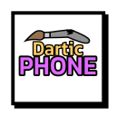
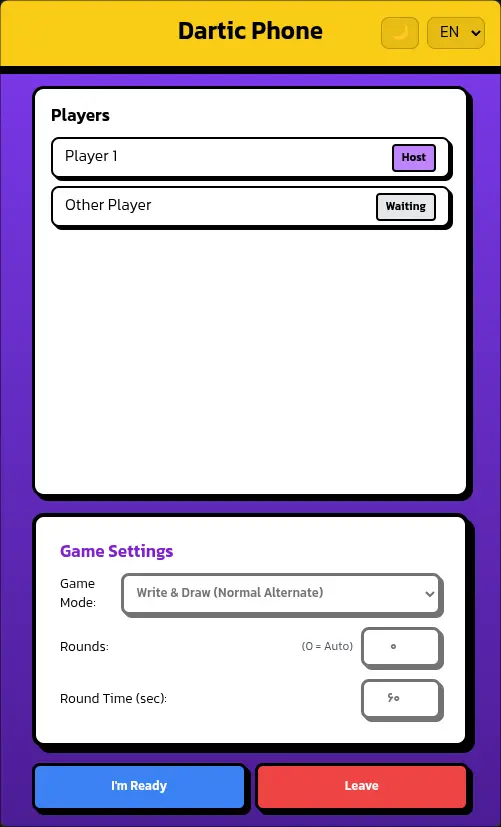
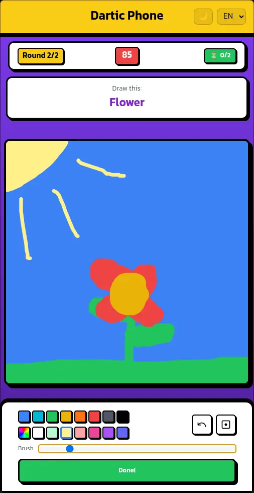

  

<h1 align="center">Dartic Phone</h1>

**Dartic Phone** is a [webxdc](https://webxdc.org) app that runs inside **Delta Chat**, letting you and your chat members play a telephone-style drawing game — write a prompt, pass it on, draw what you see, guess again, and watch the hilarious chain unfold:

- 🎨 **Telephone-style chains** — Players alternate between writing prompts and drawing them; at the end every player's prompt→drawing→guess chain is revealed as its own album
- 🎮 **Seven game modes** — Write & Draw (alternating), Draw & Write, Only Draw, Only Write, and write-only at the start, end, or both
- 🔢 **Configurable rounds** — Set the number of rounds (0 = one per player), each with its own per-round time limit
- ⏱️ **Round timer** — Countdown with auto-submit and a grace period, so rounds never stall
- ✏️ **Full drawing toolkit** — Brush with adjustable stroke size, a 17-color palette plus a custom color picker, fill bucket and undo
- 🧅 **Onion-skin preview** — When drawing, the previous drawing is shown as a faded reference layer
- 🕹️ **Lobby & hosting** — Ready-up system, host kick, and automatic host failover if the host goes idle mid-game
- 👻 **Spectator-safe** — Players who miss a round or join late become spectators; the game keeps advancing with the active players
- 📊 **Results screen** — Each player's album is revealed step by step with tabs to jump between albums
- 🎬 **Share results** — Export any album as a WebM video and send it straight to the chat, or copy a text transcript of the album
- ⏳ **Live round status** — Check who has submitted during a round via the hourglass button
- 🌐 **Multi-language support** — Persian (RTL) and English (LTR), auto-detected from the device language
- 🎨 **Light & dark themes**

## Screenshot

 

## Development

The app is plain HTML/CSS/JS with no build step. Open `index.html` directly in a browser to develop — outside Delta Chat a built-in `webxdc` fallback kicks in, so the app works with `localStorage` persistence and uses a `BroadcastChannel` to sync between tabs. Open the app in several browser tabs to simulate a multiplayer game locally; sharing simply becomes a file download, and a "Reset room" button clears the mock room.

To test real chat integration, package the folder as a `.zip` file, rename it to `.xdc` and share it in a DeltaChat chat.

### Adding a language

Add a new dictionary entry in the `translations` object in `i18n.js` (copy the `en` block and translate the strings), then add a matching `<option>` to the language selector in `index.html`.
